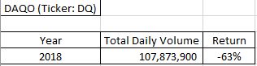
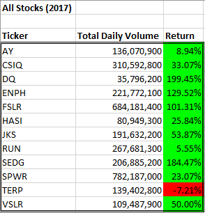
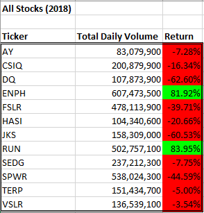
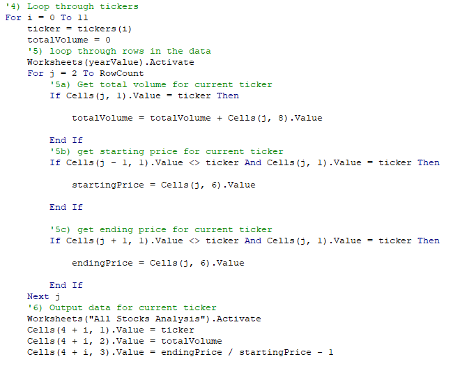
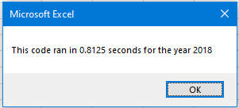
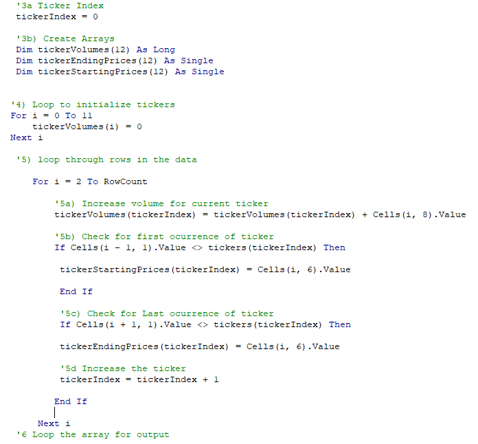
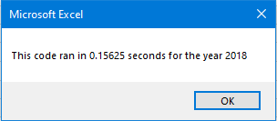
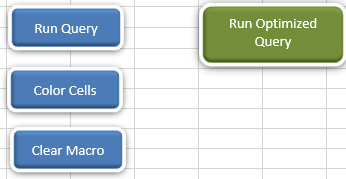

# Analyzing Stock Data Using VBA

## Overview of Project

The main objective for this project is to analyze stock data, find the daily volume that is the total number of shares traded throughout the day (it measures how actively a stock is traded) and yearly return for each stock, the yearly return is the percentage difference in price from the beginning of the year to the end of the year.

### Background
Steve's parents wanted to know how actively DQ was traded in 2018. They believe that if a stock is traded often, then the price will accurately reflect the value of the stock. Unfortunately, during the initial analysis, it was found that DQ performance during 2018 was not optimal and Steve wanted to provide better options to invest to his parents.

### Purpose
The purpose of this report is to provide Steve with the flexibility, tools, and visualizations to analyze multiple stocks throughout the years to find some better choices for them to invest. The code for this report has been refactored to provide a better performance in case Steve wants to analyze larger datasets.

## Results

### Analysis of DQ Performance in 2018
DQ Performance during 2018 was not good, the total number of daily traded DQ shares ranks 7th among all other stocks and the return is negative (-62.6%). Definitively we need to analyze better options and look at distinct year performances to check for trends.

### Analysis of all Stocks Performance in 2017
DQ performance in 2017 was actually pretty good, it ranked number 1 in returns with 199.4% of return. Not only that, but there were also other 3 tickers that returned over 100% (ENPH, FSLR and SEDG).
Only one of the stocks had a negative return during 2017 (TERP).
You can say that 2017 was a reasonably safe year to invest 😉

### Analysis of all Stocks Performance in 2018
The overall picture has changed, but not only for DQ, during 2018 most of the stock had a negative performance. Only 2 stocks had a positive return, ENPH and RUN, however ENPH is the one that has achieved a good performance during 2017 & 2018, if the trend continues its probably one of the best choices to invest.

## Summary
### Advantages and disadvantages of refactoring code in general:
Refactoring Improves the Design of Software making it more efficient and making it easier to understand, it can help to identify bugs and duplicated talks, it also allows to create a more dynamic code that adapts to the changes in a constantly changing environment.

### Disadvantages of code refactoring
Among the disadvantages of code refactoring is that this task is time-consuming and can be expensive and a complex task. When refactoring there are multiple factors to consider, including code release time and costs.

### Advantages and disadvantages of the original and refactored VBA script 
The initial code looped through the entire data set matching the ticker and collecting its data, this loop was repeated for each one of the tickers making necessary to read the data 12 times.

The VBA code includes a time to measure the performance of the query. In this case we can observe that for 2018 it took 0.8125 seconds.

The refactored code improved the timing performance by creating a tickerIndex variable and set it equal to zero before iterating over all the rows. The tickerIndex was used to access the correct index across four different arrays. 

With the new code the elapsed time improved to a benchmark of 0.1562 seconds.
However, this new code is dependent that the Ticker data is grouped by stock name, otherwise the code will not work.

The VBA project includes two buttons to test the performance of the original and refactored codo, to color the cells (Green & Red) to provide easy vizualization of positive and negative results and a fourth button to clear the results.

